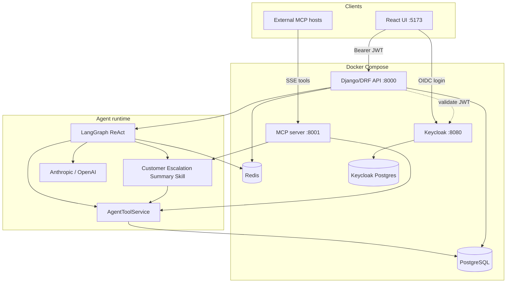

# Acme Operations — Agentic Enterprise Assistant

Minimal working prototype for the Applied AI Engineer case study: a Keycloak-authenticated assistant that uses an LLM agent, PostgreSQL data, Redis memory, MCP tools, and a reusable Skill.

## Quick start

```bash
# 1. Add LLM keys
cp .env.example backend/.env   # or edit backend/.env
# ANTHROPIC_API_KEY=...
# OPENAI_API_KEY=...           # optional

# 2. Run everything
docker compose up --build

# 3. Open UI
open http://localhost:5173
```

Backend layout, commands, and API table: [`backend/README.md`](backend/README.md).

Demo users (Keycloak):

| User | Password | Role |
|------|----------|------|
| `sales` | `sales123` | sales_user (read) |
| `support` | `support123` | support_user (read + update issues + next actions) |
| `admin` | `admin123` | admin (all issues + updates + next actions) |

## Architecture diagram



ASCII summary of the same flow:

```
Browser (React + Keycloak login)
    │  JWT
    ▼
Django/DRF API ──► LangGraph ReAct agent
    │                    │
    │                    ├─ AgentToolService (domain tools)
    │                    ├─ CustomerEscalationSummarySkill
    │                    └─ LLM (Anthropic / OpenAI-compatible)
    │
    ├── PostgreSQL (customers, issues, chat, agent runs)
    ├── Redis (warm session / caches)
    ├── Keycloak (+ dedicated Postgres)
    └── MCP server (same tools over Model Context Protocol)
```

### Why MCP

MCP separates **tool definitions/transport** from the **agent runtime**. The LangGraph agent calls in-process tools for low latency inside our API. The MCP server exposes the *same* Acme capabilities to external hosts (Cursor, Claude Desktop, other agents) without embedding SQL or RBAC rules in those hosts. Domain logic stays in `AgentToolService` / Skills; MCP is an adapter.

### Skills vs tools

| | Tools | Skill |
|---|---|---|
| Granularity | Single capability | Multi-step workflow |
| Example | `summarise_issue_history` | `customer_escalation_summary` |
| Behaviour | One DB/LLM call | Profile → open issues → issue summaries → structured brief |

The **Customer Escalation Summary** skill returns executive summary, risk level, recommended next action, and missing information.

## Data & auth trade-offs

### Redis vs Postgres

| Store | Holds |
|-------|--------|
| **Postgres** | Durable customers, issues, updates, next actions, chat conversations/messages, agent-run traces |
| **Redis** | Warm session cache, customer/tool caches, short-TTL debug traces |

Chat agent context uses a **sliding window** of the last `AGENT_HISTORY_MAX_TURNS` (default 8) messages from **Postgres**, with each turn capped at `AGENT_HISTORY_MAX_CHARS_PER_TURN` (default 1200). Redis is rehydrated when empty; if Redis is down, multi-turn chat still works via Postgres.

### `users` / `user_roles` tables

The brief lists `users` or `user_roles` as a minimum schema item. **This prototype does not duplicate users in Postgres.** Identities and roles (`sales_user`, `support_user`, `admin`) live in **Keycloak**; the API trusts the JWT and enforces RBAC in services/views. Admins manage users from the **Users** page (`/users`), which proxies the Keycloak Admin REST API (local demo uses the master `admin-cli` bootstrap credentials). Rationale: one source of truth for authn/z, less sync drift, Keycloak is already a hard requirement.

### RBAC (demonstrated)

| Role | Issues list | Status / timeline note | Issue CRUD | Customer CRUD | Create next action (agent tool) |
|------|-------------|------------------------|------------|---------------|----------------------------------|
| `sales_user` | Assigned only | No | No | No (read directory) | No (tool returns RBAC error) |
| `support_user` | Assigned only | Yes (`PATCH` status, `POST .../updates/`) | No | No (read directory) | Yes |
| `admin` | All issues | Yes | Yes | Yes | Yes |

## Agent tools

1. `get_customer_profile`
2. `get_open_issues_for_customer` (exact / partial / keyword)
3. `summarise_issue_history` (LLM)
4. `create_next_action` (LLM recommend + persist; support/admin)
5. `customer_escalation_summary` (Skill)

## Evaluation & observability

**Latest live harness result: 15/15** (Anthropic `claude-sonnet-4-5-20250929`).

Full eval narrative (case map, earlier failures/fixes, limits, brief mapping):  
**[`backend/evals/RESULTS.md`](backend/evals/RESULTS.md)** — sits beside raw `evals/results/latest.md` (gitignored machine output).

```bash
cd backend
python manage.py eval_agent --provider anthropic
# Raw output (gitignored): backend/evals/results/latest.json + latest.md

# Optional DeepEval judge on stored AgentRun replies
python manage.py eval_deepeval
```

Coverage snapshot: tool selection, grounding, RBAC, next-action + skill, Redis memory/cache. Earlier fixes included model id, partial customer names, and Client X keyword match.

Observability on each `/api/chat/` request:

- `tool_trace`, `trace_id`, `latency_ms`, token totals
- Durable Postgres: `AgentRun`, `LlmCall`, `ToolCall`
- Admin UI at `/observability` (admin only)
- Structured logs (`acme.llm`, `acme.observability`)

Chat UX: conversation list/resume, Markdown replies, expandable Markdown/JSON on Observability.

```bash
python manage.py run_agent_smoke --message "Summarise Contoso open issues"
```

## MCP server

Container listens on `http://localhost:8001` (SSE). Tools mirror the agent tools plus the escalation skill.

```bash
docker compose logs -f mcp
```

## Local tests (no live LLM)

```bash
cd backend
python manage.py test core.tests issues.tests
```

## Deliverables map

| Pack item | Where |
|-----------|--------|
| Code + Compose | this repo |
| README / architecture diagram | this file (mermaid above) |
| Eval results + commentary | [`backend/evals/RESULTS.md`](backend/evals/RESULTS.md) + local `evals/results/` |
| AI usage notes | section below |

## AI tool usage notes (assessment)

### How AI was used

Cursor (AI coding assistants) was used throughout this case study as a **pair-programming accelerator**, not as an unsupervised code generator. The working loop was:

1. **Design first** — stack, folder layout, libs, and patterns were decided up front (often sketched or iterated in chat).
2. **Implement with AI** — scaffolding and boilerplate were generated against that design.
3. **Review and reshape by hand** — every meaningful chunk was read, tested, and changed where the design or product rules needed to win.

### What stayed human-owned

- **Backend shape**: Python / Django + DRF, app split (`core` vs `issues`), service-based OOP (thin views → services → models), RBAC helpers living **per app** (`core/permissions.py`, `issues/permissions.py`) rather than one dumping ground.
- **Agent design**: LangGraph ReAct orchestrator, tool contracts, prompts, Skills vs tools, Redis memory + Postgres as source of truth, MCP as an adapter over the same domain services.
- **Frontend shape**: React + TypeScript, feature folders, React Hook Form for forms, TanStack Query for server state, shared widgets (`CustomModal`, `TextField`), create/edit forms keyed by optional `id`.
- **Product / security choices**: Keycloak-only identities (no local `users` table), admin vs support vs sales gates, delete confirmations, “don’t delete customers with open issues”, eval harness and honesty about MCP’s synthetic admin user.

### What AI sped up

Scaffolding services, serializers/views, MCP wiring, UI pages/modals, unit/API tests, Docker/env glue, and first-pass wording for docs. AI was also useful for exploring options (e.g. permission layout, history windowing, observability models) before committing to one approach.

### Guardrails

LLM outputs inside the product (summarise / next-action / escalation) are treated as **assistive** and grounded only on tool-fetched context. Secrets never belong in git; API keys stay in local `.env`. Eval failures (model IDs, partial customer names, keyword search) were chased down and fixed with human judgment, not accepted as “the model said so.”
